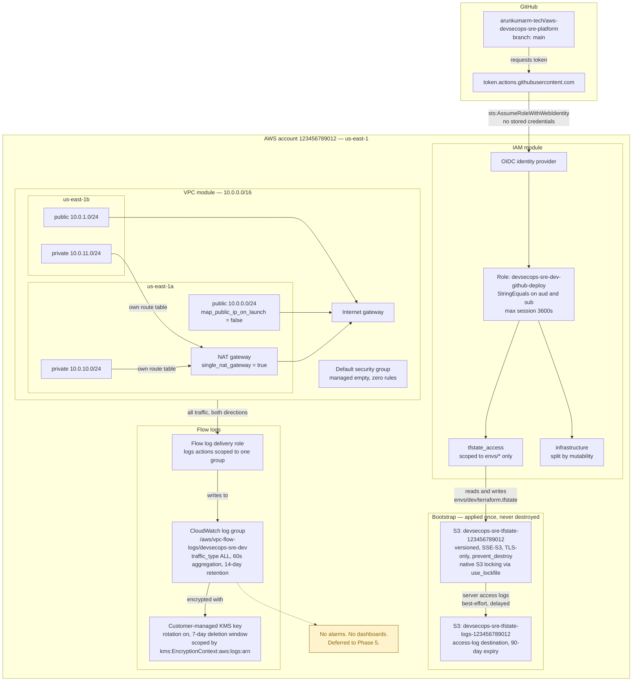

# Architecture

Phase 1 builds three things that barely touch each other: somewhere for Terraform state to live, a network, and a way for CI to authenticate. They are separate on purpose. The state backend has to exist before anything else can be applied, and the deploy role deliberately cannot reach the state backend's own state.

## Diagram

## Walkthrough

**Bootstrap.** `terraform/bootstrap/` creates the state bucket and its access-log bucket, and it is the only configuration applied against its own local state before migrating to S3. It is applied once. `prevent_destroy = true` on the state bucket means Terraform refuses to plan its deletion, so an accidental `terraform destroy` in that directory fails rather than removing the foundation of everything else.

State locking is native to S3 through `use_lockfile = true`, which writes a `.tflock` object beside the state file using S3 conditional writes. There is no DynamoDB table.

**The environment.** `terraform/envs/dev/` calls both modules and holds the backend configuration. It is the only place with a `providers.tf`, and its provider block sets `default_tags` for `Project`, `Environment`, and `ManagedBy`, which is what makes the IAM policy's tag conditions work without any module having to think about them.

The modules themselves contain no `providers.tf` and no `backend.tf`. A module that declares its own provider configuration cannot be reused anywhere else, because provider configuration belongs to the root that calls it. That is a Terraform convention with teeth rather than a style preference.

**The network.** One `/16` split into `/24`s by `cidrsubnet()`, two availability zones, public and private in each. Public subnets share a route table pointing at the internet gateway. Each private subnet gets its own route table pointing at a NAT gateway, so flipping `single_nat_gateway` to `false` is a variable change rather than a restructuring.

The default security group is managed as a resource with no rules, so anything that lands on it by accident can reach nothing.

**Observability, such as it is.** VPC flow logs capture all traffic to a CloudWatch log group encrypted with a customer-managed KMS key. The key policy grants CloudWatch Logs only what it needs, and constrains it to one log group through the encryption context that CloudWatch passes on every call. The delivery role can write to that one log group and nowhere else.

Nothing reads any of it automatically. There are no metric filters, no alarms, and no dashboards. Phase 5.

**CI authentication.** The OIDC provider registers GitHub as a trusted token issuer. The deploy role's trust policy requires an exact match on both the audience and the subject, so only a push to `main` in the named repository can assume it. The role can write state under `envs/*` and cannot touch `bootstrap/terraform.tfstate`, which means a compromised pipeline cannot destroy the bucket holding its own state.

No workflow uses this yet. Phase 4.

## What is not here

There is no compute, no container platform, no application, and no data store. There is no CloudTrail, no GuardDuty, and no AWS Config. There are no alarms or dashboards. Nothing spans a second region.

Phase 1 was the network and the trust relationships, verified, and nothing beyond that.
